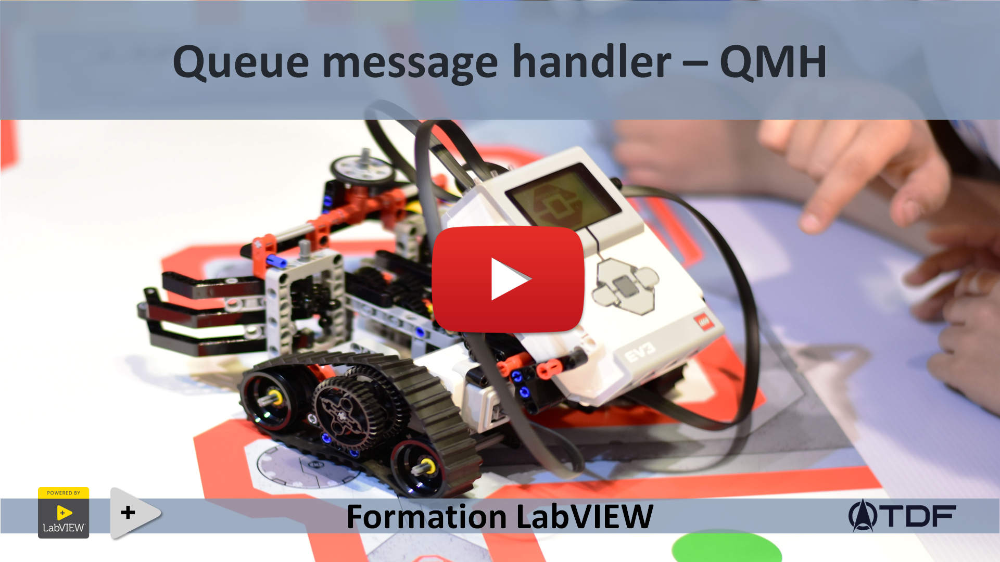

<h2 dir="auto" id="h_75746598831655196174577"><strong>Queue message handler - QMH&nbsp;&nbsp;</strong><strong>(Partie 1 /3)</strong></h2>
<ul dir="auto">
<li>Compr&eacute;hension de l'architecture QMH (standard NI) - initialisation, process et sortie.</li>
<li>Notion de files (FIFO)</li>
<li>Notion d'&eacute;v&egrave;nement cr&eacute;&eacute;</li>
<li>Notion du producteur/consommateur</li>
</ul>

&nbsp;

<table border="0" style="width: 100%; border-collapse: collapse; border-style: none;">
<tbody>
<tr>
<td style="width: 50%;"><a href="/C-3 Machine d'&eacute;tat, le template NI/">Pr&eacute;c&eacute;dent (Machine d'&eacute;tat - Le template NI)</a> </td>
<td style="width: 50%; text-align: right;"><a href="/D-2%20Queue message handler - QMH - Calculatrice 1/">Suivant (QMH - Application : Calculatrice 1)</a></td>
</tr>
</tbody>
</table>

