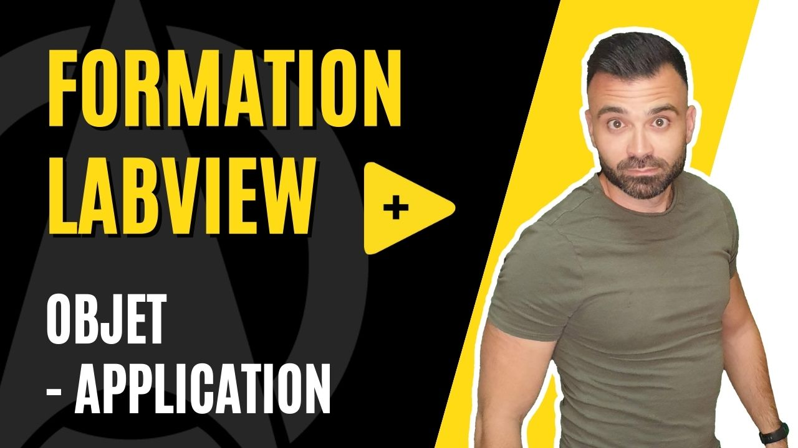

<h2 dir="auto" id="user-content-h_174031069121655196260265"><strong>Programmation orient&eacute;e objet (POO) - Application </strong><strong>(Partie 2/3)</strong></h2>
<ul dir="auto">
<li>Notion d'h&eacute;ritage</li>
<li>Notion d'accès aux m&eacute;thodes</li>
<li>Notion de polymorphisme</li>
</ul>

&nbsp;

<table border="0" style="width: 100%; border-collapse: collapse; border-style: none; height: 18px;">
<tbody>
<tr style="height: 18px;">
<td style="width: 50%; height: 18px;"><a href="https://github.com/Technologies-de-France/Formation-LabVIEW/tree/main/H-1%20Programmation%20orient%C3%A9e%20objet%20(POO)%20-%20Introduction">Pr&eacute;c&eacute;dent (Programmation orient&eacute;e objet (POO) - Introduction)</a> </td>
<td style="width: 50%; text-align: right; height: 18px;"><a href="https://github.com/Technologies-de-France/Formation-LabVIEW/tree/main/H-2%20Programmation%20orient%C3%A9e%20objet%20(POO)%20-%20Application">Suivant (Programmation orient&eacute;e objet (POO) - Utilisation)</a></td>
</tr>
</tbody>
</table>

