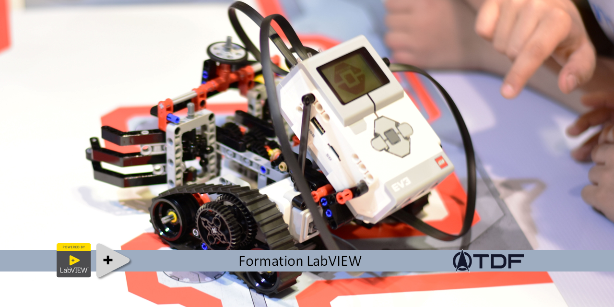

# Formation LabVIEW

<table style="height: 171px; width: 679px;">
<thead>
<tr style="height: 153px;">
<td style="height: 153px; width: 150px;"></td>
<td style="height: 153px; width: 311.736px;"><strong>Bienvenue dans la formation TDF LabVIEW&nbsp;</strong></td>
<td style="width: 197.986px;"></td>
</tr>
</thead>
</table>

Cette formation, en langue fran&ccedil;aise, est gratuite et libre de droit. Ici vous pourrez commencer &agrave; acqu&eacute;rir des connaissances en programmation LabVIEW "from scratch" et vous am&eacute;liorer jusqu'au niveau Architecte.

&nbsp;

Organisation de la formation

<table border="0" style="height: 468px; width: 47.9902%; border-collapse: collapse;">
<tbody>
<tr style="height: 18px;">
<td style="width: 69.2755%; height: 18px;"><strong>Pr&eacute;sentation de l&rsquo;environnement</strong></td>
</tr>
<tr style="height: 18px;">
<td style="width: 69.2755%; height: 18px;"><a href="/A-1 Pr&eacute;sentation de l&rsquo;environnement LabVIEW et notions de base/">Notions de base</a></td>
</tr>
<tr style="height: 18px;">
<td style="width: 69.2755%; height: 18px;"><a href="/A-2 Pr&eacute;sentation des Structures/">Structures de programmation</a></td>
</tr>
<tr style="height: 18px;">
<td style="width: 69.2755%; height: 18px;"><a href="/A-3 Pr&eacute;sentation des Tableaux, Clusters et sous-VI/">Tableaux, Clusters et sous-VI</a></td>
</tr>
<tr style="height: 18px;">
<td style="width: 69.2755%; height: 18px;"><strong>Application &agrave; la programmation</strong></td>
</tr>
<tr style="height: 18px;">
<td style="width: 69.2755%; height: 18px;"><a href="/B-1 Application &agrave; la programmation - Calculatrice 1/">Calculatrice 1</a></td>
</tr>
<tr style="height: 18px;">
<td style="width: 69.2755%; height: 18px;"><a href="/B-2 Application &agrave; la programmation - Calculatrice 2/">Calculatrice 2</a></td>
</tr>
<tr style="height: 18px;">
<td style="width: 69.2755%; height: 18px;"><strong>Machine d'&eacute;tat</strong></td>
</tr>
<tr style="height: 18px;">
<td style="width: 69.2755%; height: 18px;"><a href="/C-1 Machine d'&eacute;tat, pr&eacute;sentation/">Pr&eacute;sentation </a></td>
</tr>
<tr style="height: 18px;">
<td style="width: 69.2755%; height: 18px;"><a href="/C-2 Machine d'&eacute;tat, Application Calculatrice/">Application : Calculatrice</a></td>
</tr>
<tr style="height: 18px;">
<td style="width: 69.2755%; height: 18px;"><a href="/C-3 Machine d'&eacute;tat, le template NI/">Le template NI</a></td>
</tr>
<tr style="height: 18px;">
<td style="width: 69.2755%; height: 18px;"><strong>Queue message handler (QMH)</strong></td>
</tr>
<tr style="height: 18px;">
<td style="width: 69.2755%; height: 18px;"><a href="/D-1 Queue message handler - QMH/">Pr&eacute;sentation</a></td>
</tr>
<tr style="height: 18px;">
<td style="width: 69.2755%; height: 18px;"><a href="/D-2%20Queue message handler - QMH - Calculatrice 1/">Application : Calculatrice 1</a></td>
</tr>
<tr style="height: 18px;">
<td style="width: 69.2755%; height: 18px;"><a href="/D-3%20Queue message handler - QMH - Calculatrice 2/">Application : Calculatrice 2 (multithread)</a></td>
</tr>
<tr style="height: 18px;">
<td style="width: 69.2755%; height: 18px;"><strong>Functional Global Variable (FGV)</strong></td>
</tr>
<tr style="height: 18px;">
<td style="width: 69.2755%; height: 18px;"><a href="/E-1%20FGV, Pr&eacute;sentation/">Pr&eacute;sentation</a></td>
</tr>
<tr style="height: 18px;">
<td style="width: 69.2755%; height: 18px;"><a href="/E-2%20FGV - Chronom&egrave;tre/">Application : Le chronom&egrave;tre</a></td>
</tr>
<tr style="height: 18px;">
<td style="width: 69.2755%; height: 18px;"><a href="/E-3%20FGV - File/">Application : Fichier INI</a></td>
</tr>
<tr style="height: 18px;">
<td style="width: 69.2755%; height: 18px;"><strong>Certified LabVIEW Developer (CLD)</strong></td>
</tr>
<tr style="height: 18px;">
<td style="width: 69.2755%; height: 18px;"><a href="/F-1%20CLD Presentation/">Pr&eacute;sentation</a></td>
</tr>
<tr style="height: 18px;">
<td style="width: 69.2755%; height: 18px;"><a href="/F-2%20CLD Cauchemar en LabVIEW/">Cauchemar en LabVIEW</a></td>
</tr>
<tr style="height: 18px;">
<td style="width: 69.2755%; height: 18px;"><a href="/F-3%20CLD Application/">Application : Examen</a></td>
</tr>
<tr style="height: 18px;">
<td style="width: 69.2755%; height: 18px;"><strong>Certified LabVIEW Architect (CLA)</strong></td>
</tr>
<tr style="height: 18px;">
<td style="width: 69.2755%; height: 18px;"><a href="/G-1%20CLA Pr&eacute;sentation/">Pr&eacute;sentation</a></td>
</tr>
<tr style="height: 18px;">
<td style="width: 69.2755%; height: 18px;"><a href="/G-2%20CLA Application/">Application : Examen</a></td>
</tr>
</tbody>
</table>

<strong>Saison 2 </strong>

<table border="0" style="height: 298px; width: 69.2755%; border-collapse: collapse;">
<tbody>
<tr style="height: 18px;">
<td style="width: 69.2755%; height: 18px;"><strong>Programmation orient&eacute;e objet (POO)</strong></td>
</tr>
<tr style="height: 18px;">
<td style="width: 69.2755%; height: 18px;"><a href="/H-1 Programmation orient&eacute;e objet (POO) - Introduction/">Introduction et&nbsp;Notions de base</a></td>
</tr>
<tr style="height: 18px;">
<td style="width: 69.2755%; height: 18px;"><a href="/H-2 Programmation orient&eacute;e objet (POO) - Application/">Application</a></td>
</tr>
<tr style="height: 18px;">
<td style="width: 69.2755%; height: 18px;"><a href="/H-3 Programmation orient&eacute;e objet (POO) - Utilisation/">Utilisation</a></td>
</tr>
<tr style="height: 18px;">
<td style="width: 69.2755%; height: 18px;"><b>Actor Framework (AF)</b></td>
</tr>
<tr>
<td style="width: 69.2755%;"><a href="/k - 1 - Actor framework - introduction/">Introduction et&nbsp;Notions de base</a></td>
</tr>
<tr>
<td style="width: 69.2755%;"><a href="/k%20- 2 - Actor framework - actor/">L'actor</a></td>
</tr>
<tr>
<td style="width: 69.2755%;"><a href="/k%20- 3 - Actor Framework - Architecture/">Architecture 1</a></td>
</tr>
<tr>
<td style="width: 69.2755%;"><a href="/k%20- 4 - Actor Framework - Architecture - part 2/">Architecture 2</a></td>
</tr>
<tr>
<td style="width: 69.2755%;"><a href="/k%20- 5 - Actor Framework - nested/">Nested</a></td>
</tr>
<tr>
<td style="width: 69.2755%;"><a href="/k%20- 6 - Actor Framework - message/">Message</a></td>
</tr>
<tr style="height: 18px;">
<td style="width: 69.2755%; height: 18px;"><strong>LabVIEW connectivity</strong></td>
</tr>
<tr style="height: 10px;">
<td style="width: 69.2755%; height: 10px;"><a href="/I%20- 1 Connectivity - .net/">Le .net</a></td>
</tr>
</tbody>
</table>

<strong>Saison 3</strong><strong></strong>

<table border="0" style="height: 213px; width: 69.2755%; border-collapse: collapse;">
<tbody>
<tr style="height: 18px;">
<td style="width: 69.2755%; height: 18px;"><strong>Datasave</strong></td>
</tr>
<tr style="height: 18px;">
<td style="width: 69.2755%; height: 18px;">Les fichiers</td>
</tr>
<tr style="height: 18px;">
<td style="width: 69.2755%; height: 18px;">Les registres (Regedit)</td>
</tr>
<tr style="height: 18px;">
<td style="width: 69.2755%; height: 18px;"><strong>Database</strong></td>
</tr>
<tr>
<td style="width: 69.2755%;">Introduction</td>
</tr>
<tr>
<td style="width: 69.2755%;">SQL DB</td>
</tr>
<tr style="height: 18px;">
<td style="width: 69.2755%; height: 18px;"><strong>Webserver</strong></td>
</tr>
<tr style="height: 18px;">
<td style="width: 69.2755%; height: 18px;">Introduction&nbsp;- Client</td>
</tr>
<tr style="height: 18px;">
<td style="width: 69.2755%; height: 18px;">NI WebServer - Server</td>
</tr>
<tr style="height: 15px;">
<td style="width: 69.2755%; height: 15px;">NI WebServer - D&eacute;ploiement</td>
</tr>
<tr style="height: 18px;">
<td style="width: 69.2755%; height: 18px;"><strong>LabVIEW UI</strong></td>
</tr>
<tr style="height: 18px;">
<td style="width: 69.2755%; height: 18px;">Les menus</td>
</tr>
<tr style="height: 18px;">
<td style="width: 69.2755%; height: 18px;">Boutons en vectoriel</td>
</tr>
<tr style="height: 18px;">
<td style="width: 69.2755%; height: 18px;">Xcontrol</td>
</tr>
</tbody>
</table>

<strong>Liste des th&egrave;mes encore &agrave; aborder dans le futur ...&nbsp;</strong>

<strong></strong>

<table width="188" style="width: 479px; height: 108px;">
<tbody>
<tr style="height: 18px;">
<td style="width: 469px; height: 18px;">Le Java</td>
</tr>
<tr style="height: 18px;">
<td style="width: 469px; height: 18px;">Le JavaScript</td>
</tr>
<tr style="height: 18px;">
<td style="width: 469px; height: 18px;">le scripting</td>
</tr>
</tbody>
</table>
