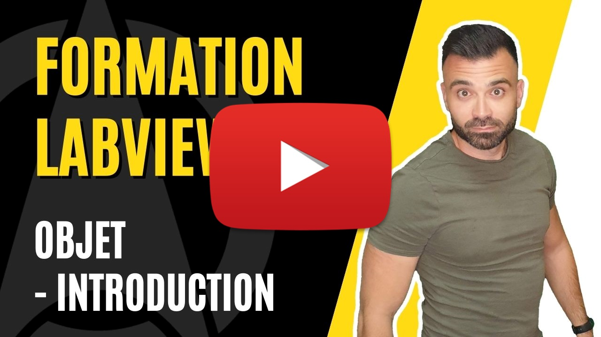

<h2 dir="auto" id="user-content-h_174031069121655196260265"><strong>Programmation orient&eacute;e objet (POO) - Introduction </strong><strong>(Partie 1/3)</strong></h2>
<ul dir="auto">
<li>Notion de Methodes</li>
<li>Notion d'attributs</li>
</ul>

&nbsp;

