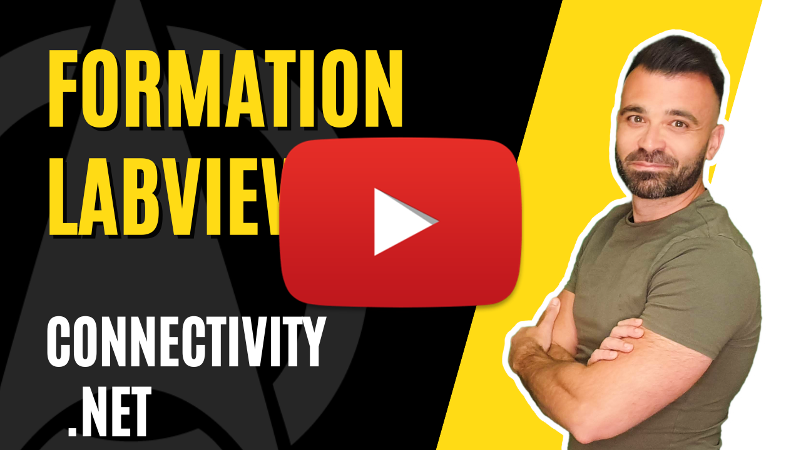

<h2 dir="auto" id="user-content-h_174031069121655196260265"><strong>Connectivity - .net </strong><strong>(Partie 1/3)</strong></h2>

Chapitre sur la connectivity LabVIEW avec le .net

<ul dir="auto">
<li>Notion de connectivity</li>
<li>Notion de .net (Assembly, class, constructeur ...)</li>
<li>Utilisation de ChatGPT pour la documentation des fonctions .net</li>
</ul>

Lien vers la documentation .net microsoft <a href="https://learn.microsoft.com/fr-fr/dotnet/api/system.io.filesystemaclextensions.getaccesscontrol?view=net-7.0">ici</a>

&nbsp;

