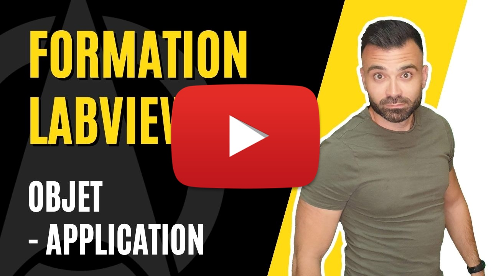

<h2 dir="auto" id="user-content-h_174031069121655196260265"><strong>Programmation orient&eacute;e objet (POO) - Application </strong><strong>(Partie 2/3)</strong></h2>
<ul dir="auto">
<li>Notion d'h&eacute;ritage</li>
<li>Notion d'acc&egrave;s aux m&eacute;thodes</li>
<li>Notion de polymorphisme</li>
</ul>

&nbsp;

