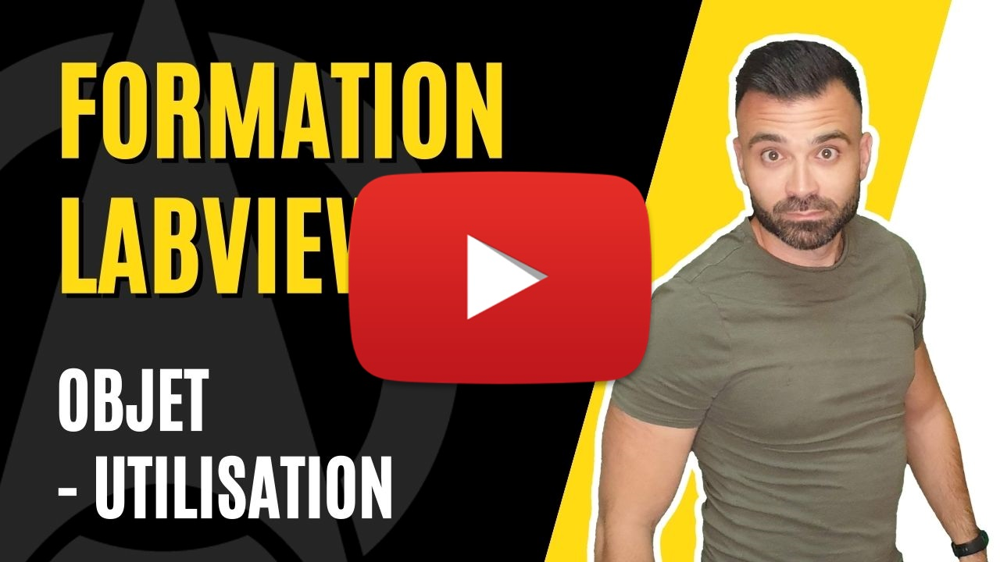

<h2 dir="auto" id="user-content-h_174031069121655196260265"><strong>Programmation orient&eacute;e objet (POO) - Utilisation </strong><strong>(Partie 3/3)</strong></h2>

Chapitre final sur les objets dans LabVIEW o&ugrave; l'on va mettre l'accent sur la nature objet de LabVIEW et de ses composants.

<ul dir="auto">
<li>Notion d'utilisation d'objets LabVIEW</li>
<li>Notion de polymorphisme d'objet LabVIEW</li>
<li>Notion d'h&eacute;ritage d'objet LabVIEW</li>
</ul>

&nbsp;

