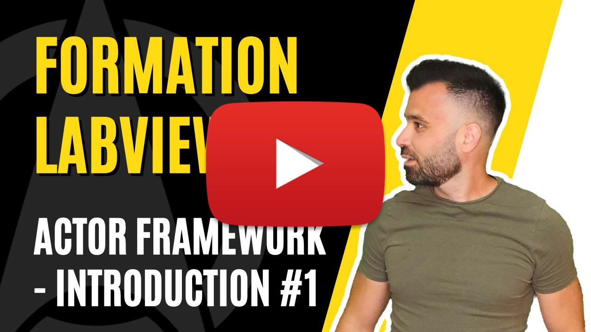

<h2 dir="auto" id="user-content-h_174031069121655196260265"><strong>Actor Framework - Introduction </strong><strong>(Partie 1/6)</strong></h2>

Chapitre sur l'architecture Actor Framework sur LabVIEW&nbsp;

<ul dir="auto">
<li>Introduction</li>
<li>Hello World</li>
</ul>

&nbsp;

