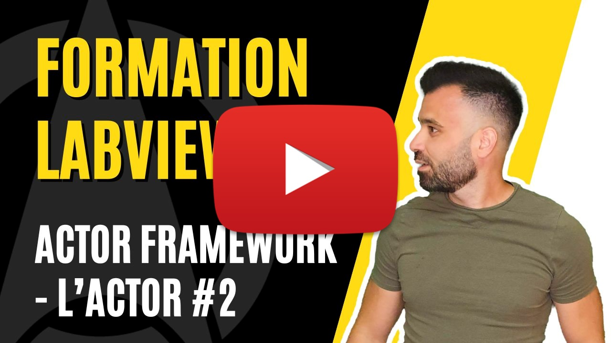

<h2 dir="auto" id="user-content-h_174031069121655196260265"><strong>Actor Framework - Actor </strong><strong>(Partie 2/6)</strong></h2>

Chapitre sur l'architecture Actor Framework sur LabVIEW&nbsp;

<ul>
<li>Forme Canonique (Actor Core, Pre Launch Init, Receive Message, Stop Core)</li>
<li>Machine d'&eacute;tats</li>
</ul>

&nbsp;

