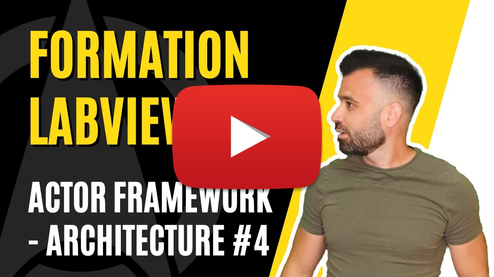

<h2 dir="auto" id="user-content-h_174031069121655196260265"><strong>Actor Framework - Architecture part 2&nbsp;</strong><strong>(Partie 4/6)</strong></h2>

Chapitre sur l'architecture Actor Framework sur LabVIEW&nbsp;

<ul>
<li>on continue l'exercice&nbsp;</li>
<li>introduction &agrave; l'actor nested</li>
</ul>

&nbsp;

