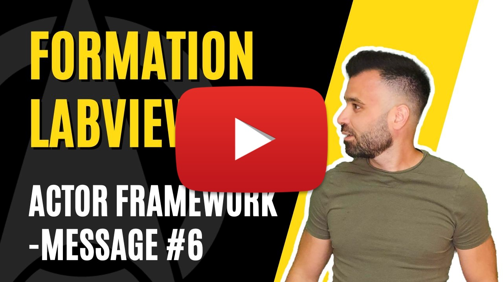

<h2 dir="auto" id="user-content-h_174031069121655196260265"><strong>Actor Framework - Message&nbsp;</strong><strong>(Partie 6/6)</strong></h2>

Chapitre sur l'architecture Actor Framework sur LabVIEW&nbsp;

<ul>
<li>On va parler des messages entre acteurs</li>
</ul>

&nbsp;

