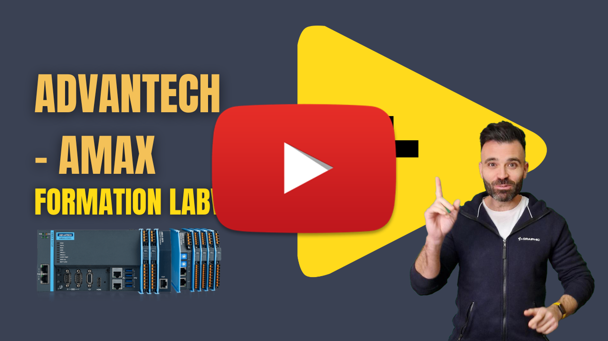

# Advantech AMAX — Plateforme embarquée industrielle sous LabVIEW

Dans ce chapitre de la **Saison 4 – Hardware & LabVIEW**, nous découvrons **AMAX d’Advantech**, une plateforme embarquée industrielle conçue pour les architectures d’acquisition distribuées, le contrôle et la supervision sur Ethernet, parfaitement adaptée aux environnements terrain sous LabVIEW.

AMAX combine des modules d’E/S industrielles, une communication réseau robuste et une intégration facilitée pour construire des systèmes embarqués fiables et évolutifs.

## Ce que vous allez apprendre

- Présentation de l’architecture AMAX et de ses modules embarqués  
- Cas d’usage typiques en acquisition et contrôle industriels distribués  
- Intégration d’AMAX dans une architecture LabVIEW Ethernet  

## Ressources LabVIEW & installation

Pour utiliser AMAX sous LabVIEW, l’installation du framework **DAQNavi** est requise.

Lien de téléchargement DAQNavi :  
https://downloadt.advantech.com/download/downloadsr.aspx?File_Id=1-33TD6WS

## Vidéo du chapitre

  

## Contenu du dépôt

Ce dépôt contient **uniquement le code LabVIEW réalisé pendant la vidéo**, incluant :

- Exemples d’E/S distribuées via AMAX  
- VIs de communication et de supervision Ethernet  
- Projet LabVIEW utilisé pour la démonstration  

Le contenu correspond strictement aux manipulations effectuées à l’écran.

## Sponsoring

Cette vidéo est sponsorisée par **Acquisys**, distributeur des solutions d’acquisition **Advantech** en France.

Pour toute information technique ou commerciale :

- **Contact** : Katia PAYET  
- **Email** : commercial@acquisys.fr  
- **Site web** : https://www.acquisys.fr/
