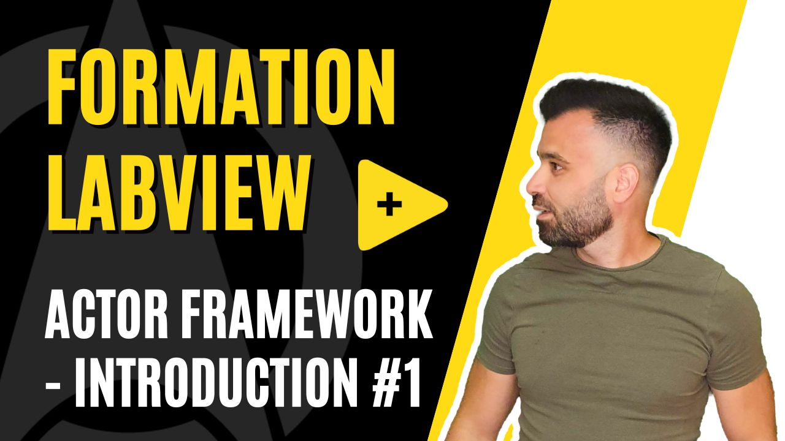

<h2 dir="auto" id="user-content-h_174031069121655196260265"><strong>Actor Framework - Introduction </strong><strong>(Partie 1/4)</strong></h2>

Chapitre sur l'architecture Actor Framework sur LabVIEW&nbsp;

<ul dir="auto">
<li>Introduction</li>
<li>Hello World</li>
</ul>

&nbsp;

<table border="0" style="width: 100%; border-collapse: collapse; border-style: none; height: 18px;">
<tbody>
<tr style="height: 18px;">
<td style="width: 50%; height: 18px;"><a href="https://github.com/Technologies-de-France/Formation-LabVIEW/tree/main/H-3%20Programmation%20orient%C3%A9e%20objet%20(POO)%20-%20Utilisation">Pr&eacute;c&eacute;dent (Programmation orient&eacute;e objet (POO) - Utilisation)</a></td>
<td style="width: 50%; text-align: right; height: 18px;"><a href="https://github.com/Technologies-de-France/Formation-LabVIEW/tree/main/H-2%20Programmation%20orient%C3%A9e%20objet%20(POO)%20-%20Application">Suivant (Actor Framework (AF) - Actor)</a></td>
</tr>
</tbody>
</table>

