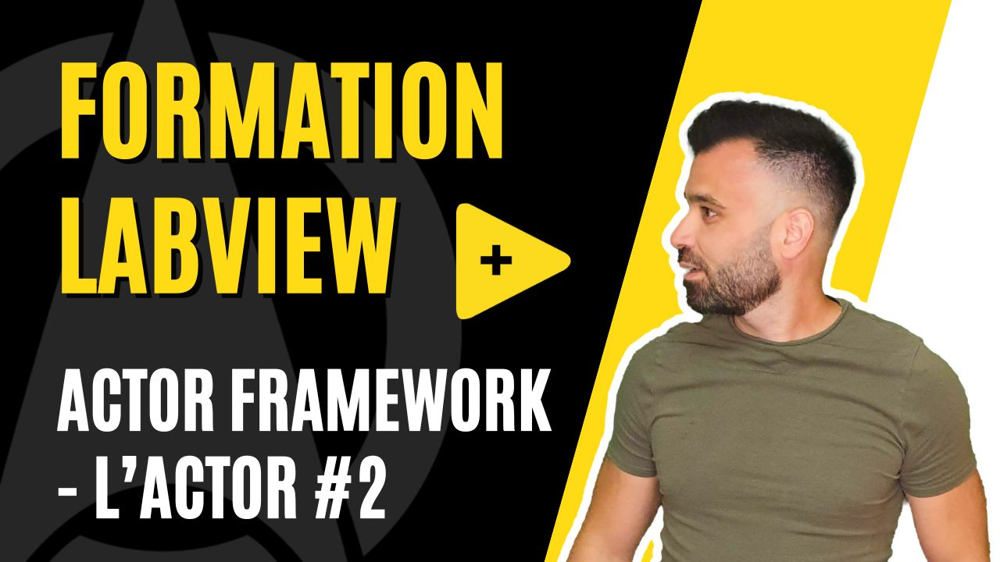

<h2 dir="auto" id="user-content-h_174031069121655196260265"><strong>Actor Framework - Introduction </strong><strong>(Partie 1/4)</strong></h2>

Chapitre sur l'architecture Actor Framework sur LabVIEW&nbsp;

<ul>
<li>Forme Canonique (Actor Core, Pre Launch Init, Receive Message, Stop Core)</li>
<li>Machine d'&eacute;tats</li>
</ul>

&nbsp;

<table border="0" style="width: 100%; border-collapse: collapse; border-style: none; height: 18px;">
<tbody>
<tr style="height: 18px;">
<td style="width: 50%; height: 18px;"><a href="https://github.com/Technologies-de-France/Formation-LabVIEW/tree/main/k%20-%201%20-%20Actor%20framework%20-%20introduction">Pr&eacute;c&eacute;dent (Actor Framework (AF)&nbsp;- Introduction)</a></td>
<td style="width: 50%; text-align: right; height: 18px;">Suivant (Actor Framework (AF) - Architecture)</td>
</tr>
</tbody>
</table>

