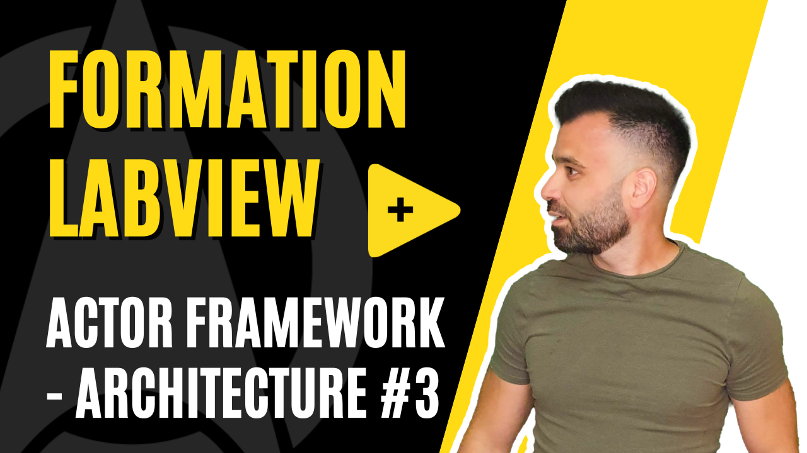

<h2 dir="auto" id="user-content-h_174031069121655196260265"><strong>Actor Framework - Architecture&nbsp;</strong><strong>(Partie 3/6)</strong></h2>

Chapitre sur l'architecture Actor Framework sur LabVIEW&nbsp;

<ul>
<li>Forme Canonique (Actor Core, Pre Launch Init, Receive Message, Stop Core, Handle Error)</li>
<li>Gestion des erreurs</li>
<li>Explication de l'architecture actor framework avec decryptage du fonctionnement de l'Actor Core</li>
</ul>

&nbsp;

<table border="0" style="width: 100%; border-collapse: collapse; border-style: none; height: 18px;">
<tbody>
<tr style="height: 18px;">
<td style="width: 50%; height: 18px;"><a href="https://github.com/Technologies-de-France/Formation-LabVIEW/blob/main/k%20-%202%20-%20Actor%20framework%20-%20actor/Readme.md">Pr&eacute;c&eacute;dent (Actor Framework (AF)&nbsp;- Actor)</a></td>
<td style="width: 50%; text-align: right; height: 18px;"><a href="https://github.com/Technologies-de-France/Formation-LabVIEW/tree/main/k%20-%204%20-%20Actor%20Framework%20-%20Architecture%20-%20part%202">Suivant (Actor Framework (AF) - Architecture2)</a></td>
</tr>
</tbody>
</table>

